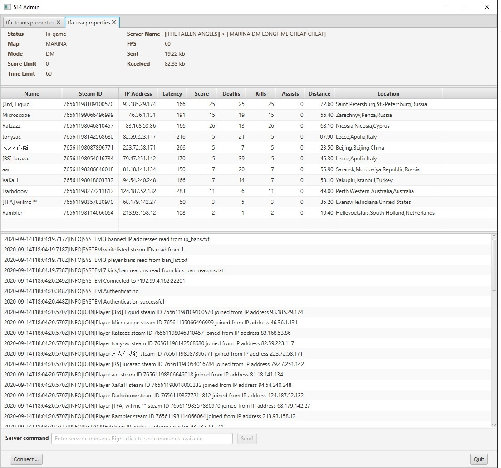

# SE4AdminTool
A tool to help with administration of the Sniper Elite 4 Dedicated Server. There are two versions:
command line intended to be run and left to its own devices (typically on a 24x7
online or home server) and an interactive GUI.

The tool is written in java to be portable across a wide range of platforms: Windows, Mac, Linux etc. 

## Features
- Logs players joining and leaving the server by steam ID and IP address.
- A friendly player greeting can be set up for whenever someone joins. See the sample configuration file for
an example.
- Players can be automatically kicked from a server with the use of ban lists by steam ID and by blacklisted IP address.
- Players can be automatically kicked if they have a steam VAC ban and/or a Game ban.  Note that this feature requires
you to provide your own Steam API key. Obtain one from <https://steamcommunity.com/dev/apikey> and
add it to your configuration files.  Note that Game bans could be for any game, not just Sniper Elite.
For a guide to steam policies refer to <https://steamcommunity.com/sharedfiles/filedetails/?id=961168214>,
particularly section 5.  **New for 1.1 update: This will also apply if the player is using a shared account
with a ban.**
- Players with closed steam profiles can (optionally) be kicked or requested to open their profiles via an in-game message.
Note this also requires a steam API key.
- Players can be **whitelisted** so that ban checks are skipped. This allows administrators to grant
specific players access to a server even if they have a steam VAC or game ban.

## Additional Features only on GUI Version
- Player information display during a game including steam ID, score, kills, longest shot.
- (Optional) See players' location (City, State, Country) based on IP address. This feature requires that you provide an API key
from <https://ipstack.com/>. A free key will allow 10,000 lookups per month.
- Kick or Ban a player (right click on player name).
- See players steam profile (right click on player name).
- Send server commands using a free text input box. Commands list is also visible via right-click on the input box.
- Colour text highlighting in the logs window based on matching keywords or regular expressions.

## Installation
A windows installer can be downloaded from <https://github.com/peterwalkley/SE4AdminTool/releases/download/1.2/TFA.SE4.Administrator_1.2.exe>. 
This will install the GUI and a java runtime environment for the application.

The zip file <https://github.com/peterwalkley/SE4AdminTool/releases/download/1.2/TFA.SE4.Administrator-1.2.zip> is available as an alternative,
download, unzip to a directory and run the exe within.

Before using the application for the first time
you will need to set up a properties files for each server you wish to administer.  Use the supplied `config.properties` 
file as a template and create a new file for each server you wish to administer.  You can open connections to multiple
servers at the same time in the GUI, each will appear in its own application tab.

## Configuration

An example server properties file, `config.properties` is included. Make a copy of this for each server you
wish to manage and then update the contents of the copies to match the server details.
At the very least you will need to change its contents to
match your server IP address, RCON port and RCON password. Include your steam API key if you
want to be able to check for VAC bans and closed profiles.

*config directory files:*

The formats of these files is hopefully fairly self-explanatory:
- `ban_list.txt` is the player bans
- `ip_bans.txt` is the list of blacklisted IP addresses
- `kick_ban_reasons.txt` is the list of choices show when kicking or banning a player
- `log_colours.txt` is the control for using coloured text in the logging window
- `whitelist.txt` is the list of whitelisted players.

## Command Line Version
The command-line version can be run via the batch file supplied, for example `seadmin.bat myserver.properties`  
Run multiple instances if you wish to monitor multiple servers. For logging to a file, re-direct as
usual: `seadmin.bat myserver.properties* > myserver.log`

## Help and Support
Server administrators should join the steam group <https://steamcommunity.com/groups/SniperEliteAdmins> as the forum
covers a range of topics related to running servers, not just this tool.

I will also accept friend requests
via my steam profile <https://steamcommunity.com/profiles/76561198022231968/> unless you have a VAC ban.
 
 ## Changelog
 ### 1.2 RELEASE
- Change detection of private profiles to match changes by steam.
- Handle linked player account no longer existing more gracefully.
- Improve detection and handling of server restarts and disconnects. 
- Log more information when game ends and player leaves to assist with data analysis.
- Change layout controls for server information pane. Text is misaligned for some people.

 ### 1.1 RELEASE
- Check if player is using a shared game instance and apply bans if the original game owner was banned. This requires a Steam API key.
- Display hours played in players table. This requires a Steam API key and that the player has made the information public.
- Fix issue where duplicate bans could be added to ban list.
- Change re-connect handler to apply a increasing retry delay starting at 10 seconds and going up to 10 minutes.
- Add copy to clipboard options for player name and steam id on the player table pop-up menu.

 ### 1.0 RELEASE
- Move to release versioning from pre-release
- Display game countdown timer on GUI
- Update IP stack logging to show location in log file
- Update example configuration to default values that work when no steam API key is present
- Don't treat using steam facilities without a steam key as an error, just switch them off (credit Muslim|Snipe|ALG for discovering the issue)
- Add an online check for later version being available (credit Kroden for the idea)
- Show version number on window title
- Add hyperlink to website on main window

 ### 0.0.6-SNAPSHOT
- Fix issue with kicks and bans on the GUI intermittently not working or selecting the wrong player.

 ### 0.0.5-SNAPSHOT
- Support for coloured text in GUI window
- Support for handling closed profiles (ignore, warn or warn and kick)

 ### 0.0.4-SNAPSHOT
- Fix window re-sizing issue
- Force US locale for messages from SE server

 ### 0.0.3-SNAPSHOT
- Uses IP location to find country, state and city information.
- Remembers servers opened and previous window size & location from last session.
- Hide location column if IPStack not in use.
- Warn in GUI log if steam or IPStack not in use.

 ### 0.0.2-SNAPSHOT 
- Log window buttons replaced with content sensitive menu
- Commands now sent using text box
- Players banned by GUI tool added to tools' ban list automatically.
 ### 0.0.1-SNAPSHOT 
- Initial release outside private repository

## TODO (if sufficient demand)
- No JRE installer and shell scripts for unix home server running the command line version
- Create configuration properties files via GUI
 